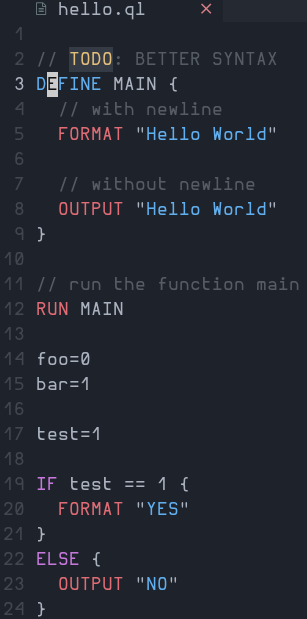

# Qs-Lang
Qs Programming Language written in Python

EXAMPLE:

Credits to [slu4coder](https://github.com/slu4coder/)
for making the simple python interpreter I utilize it 
to build this language :).

checkout his [Minimal-UART-CPU-System](https://github.com/slu4coder/Minimal-UART-CPU-System),
it's a nice repository for those who want to dig deep to creating their own minimal cpu

[run.sh](./run.sh) This is the wrapper for python to run the qs.py file

[src/Graphics](./src/Graphics/) Store's the modules related to Graphics.
  
[examples/](./examples/) This is where examples located

Implementation
  Default: [Python](python.org)
