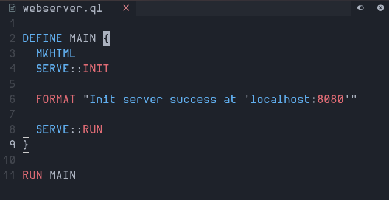

# Qs-Lang
Qs Programming Language written in Python

SERVER CODE:

EXAMPLE CODE:

[run.sh](./run.sh) This is the wrapper for python to run the qs.py file

[src/Graphics](./src/Graphics/) Store's the modules related to Graphics.
  
[examples/](./examples/) This is where examples located

Implementation
  Default: [Python](https://python.org)

Implemented:
  - Web Server (PS: You need to manually create a style.css, edit the index.html
  and also manually create the main.js)
